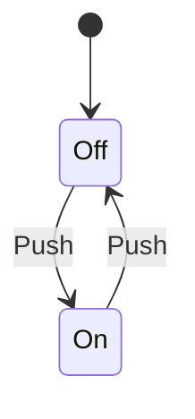

# Wzorce Projektowe w C#

## Introduction

Welcome! This is the course repository for Design Pattern in C#

To take this course you'll need the following.

1. The [.NET 8 SDK](https://dotnet.microsoft.com/en-us/download/dotnet/8.0).
2. Clone this git repository from GitHub.

## Clone the Course Git Repository

```
git clone https://github.com/your-design-patterns
```


## Graph

